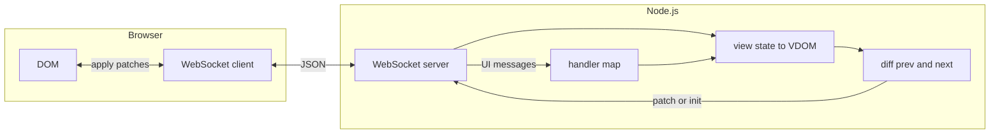

# GhostDOM

**Server-Driven UI runtime (MVP).** The server owns application state, builds a virtual DOM, diffs consecutive trees, and sends minimal patches over a WebSocket. The browser only applies patches and forwards user input—**no business logic on the client.**

---

## Contents

- [Features](#features)
- [Requirements](#requirements)
- [Quick start](#quick-start)
- [Configuration](#configuration)
- [Architecture](#architecture)
- [Virtual DOM](#virtual-dom)
- [Diffing](#diffing)
- [Events and routing](#events-and-routing)
- [Render loop](#render-loop)
- [Latency UX](#latency-ux)
- [Hot reload](#hot-reload)
- [Project structure](#project-structure)
- [Wire protocol](#wire-protocol)
- [Design constraints](#design-constraints)

---

## Features

| Capability | Description |
|------------|-------------|
| Session-scoped VDOM | One virtual tree per WebSocket connection |
| Incremental updates | `init` once, then `patch` with small op lists |
| Batched flush | Dirty sessions flushed on `setImmediate` |
| Event map | Handlers keyed by `targetId` + DOM event type |
| Dev-only tools | Optional UI + second socket for VDOM / patch stream |
| Hot reload | `view.js` / `handlers.js` watch + cache bust (development) |

---

## Requirements

- [Node.js](https://nodejs.org/) **18+** (see `engines` in [`package.json`](package.json))

---

## Quick start

```bash
npm install
npm start
```

Then open **<http://127.0.0.1:3456/>** (default port). Open two browser tabs to verify **independent sessions** (each tab owns its own counter state).

> [!TIP]
> Devtools: **<http://127.0.0.1:3456/?devtools=1>** opens a panel and a second WebSocket (`/ws?devtools=1`) that receives `devtoolsVdom` and `devtoolsPatch` messages. The client only displays JSON; it does not interpret application semantics.

---

## Configuration

Environment variables:

| Variable | Effect |
|----------|--------|
| `PORT` | HTTP and WebSocket listen port (default `3456`) |
| `NODE_ENV=production` | Disables devtools WebSocket and default hot reload |
| `GHOSTDOM_DEVTOOLS=0` | Disables devtools even outside production |
| `GHOSTDOM_DEVTOOLS=1` | Forces devtools WebSocket on |
| `GHOSTDOM_HOT_RELOAD=1` | Enables `fs.watch` on `view.js` and `handlers.js` |
| `GHOSTDOM_HOT_RELOAD=0` | Disables hot reload when not in production |

> [!NOTE]
> When `NODE_ENV` is not `production`, hot reload is enabled unless `GHOSTDOM_HOT_RELOAD=0`.

---

## Architecture



Data flow in short:

1. Server sends `init` or `patch` → client updates the DOM.
2. Client sends UI messages (`click`, `input`, …) with `sessionId` and `targetId` → server runs handlers and queues a flush.

---

## Virtual DOM

Defined in [`server/src/vdom.js`](server/src/vdom.js).

| Node kind | Shape |
|-----------|--------|
| Element | `{ id, tag, attrs, children }` |
| Text | `{ id, text }` (no `tag`) |

API:

- `createRenderContext()` → `h(tag, attrs, children)` and string children resolved to text leaves.
- `serialize(node)` produces the wire tree; **`onClick`** and **`key`** are stripped from attributes sent to the client (`key` is server-only identity).

### Element identity (`id` / `key`) — required

> [!IMPORTANT]
> Every call to **`h()`** must set **`attrs.id`** or **`attrs.key`** (non-empty). The runtime **throws** if neither is set. Auto-generated **element** IDs are disabled on purpose: reordering lists without stable keys would remap node identity and break diffs and event routing.

| Attribute | Role |
|-----------|------|
| `id` | Stable id on the wire and on the DOM (`data-sdui-id`); used as `targetId` for events when applicable. |
| `key` | Server-only; vnode id becomes `k_${key}` in wire output; not sent as an HTML attribute. |

Text nodes created from string children still receive structural ids for patching. For **dynamic or reorderable text**, wrap content in `h("span", { id: "…" })` or `h("span", { key: "…" }, …)`.

---

## Diffing

Implemented in [`server/src/diff.js`](server/src/diff.js).

| Situation | Behavior |
|-----------|----------|
| Same node identity | Same `id`, same text vs element kind, same `tag` for elements → `setText` / `setAttrs` / recurse into children. |
| Mismatch at a child slot | Single **`replaceChildren`** for that parent with the **full** next child list. |
| Root cannot be paired | **`replaceRoot`** with a full serialized tree (client remounts under `#root`). |

This keeps the algorithm small and predictable: one bad child index forces a wholesale replace for that parent’s children.

---

## Events and routing

[`server/src/handlers.js`](server/src/handlers.js) exports a map:

- **Key:** `` `${targetId}:${eventType}` `` (example: `btn-inc:click`)
- **Value:** `(session, detail) => { … }` — mutate `session.state`; **`Session.handleEvent`** already calls `queueUpdate(session)` after the handler.

The client sets **`data-sdui-id`** from each node’s `id` and resolves the nearest ancestor carrying it to obtain `targetId`.

---

## Render loop

[`server/src/renderLoop.js`](server/src/renderLoop.js) keeps a **set of dirty sessions**. **`queueUpdate(session)`** schedules **`setImmediate(flushAll)`** so several synchronous updates can collapse into one flush per macrotask when possible.

---

## Latency UX

After a user interaction, **`Session`** sets **`uiPending`**. The first rendered tree after that may include **`disabled`** and **`aria-busy`** on controls; a follow-up flush clears them. The browser only applies attributes from patches—no client-side policy.

---

## Hot reload

In development, edits to [`server/src/view.js`](server/src/view.js) or [`server/src/handlers.js`](server/src/handlers.js) trigger **`require.cache`** invalidation and a full re-init path for connected sessions (`prevTree` cleared, next flush sends `init`). Behavior during concurrent events is best-effort for a demo.

---

## Project structure

| Path | Responsibility |
|------|----------------|
| [`server/src/index.js`](server/src/index.js) | HTTP static server, WebSocket upgrade, sessions |
| [`server/src/renderLoop.js`](server/src/renderLoop.js) | `queueUpdate`, `flushAll` |
| [`server/src/session.js`](server/src/session.js) | Per-connection state, flush, devtools hook |
| [`server/src/vdom.js`](server/src/vdom.js) | `h`, text leaves, `serialize`, `wireAttrs` |
| [`server/src/view.js`](server/src/view.js) | `view(state, { uiPending })` |
| [`server/src/handlers.js`](server/src/handlers.js) | Event handler map |
| [`server/src/diff.js`](server/src/diff.js) | `diff(prev, next)` |
| [`server/src/hotReload.js`](server/src/hotReload.js) | File watch + cache bust |
| [`client/index.html`](client/index.html) | Shell, optional devtools panel |
| [`client/client.js`](client/client.js) | WebSocket, patch application, delegation |
| [`client/styles.css`](client/styles.css) | Layout and theme |

---

## Wire protocol

Messages are **JSON** over WebSocket.

### Server → client

```json
{ "type": "init", "sessionId": "<uuid>", "tree": { } }
```

```json
{ "type": "patch", "sessionId": "<uuid>", "ops": [ ] }
```

```json
{ "type": "error", "message": "…" }
```

Devtools socket (when enabled):

```json
{ "type": "devtoolsVdom", "sessionId": "<uuid>", "tree": { } }
```

```json
{ "type": "devtoolsPatch", "sessionId": "<uuid>", "ops": [ ] }
```

### Client → server (user input)

Top-level **`type`** is the **DOM / interaction** name (not a wrapper enum):

```json
{ "type": "click", "sessionId": "<uuid>", "targetId": "btn-inc" }
```

```json
{ "type": "input", "sessionId": "<uuid>", "targetId": "field-1", "detail": { "value": "…" } }
```

### Patch operations

```json
{ "op": "setText", "id": "…", "text": "…" }
```

```json
{ "op": "setAttrs", "id": "…", "attrs": { } }
```

```json
{ "op": "replaceChildren", "parentId": "…", "children": [ ] }
```

```json
{ "op": "replaceRoot", "tree": { } }
```

For **`setAttrs`**, the client replaces wire attributes on the element but **preserves** `data-sdui-id`.

---

## Design constraints

> [!WARNING]
> This repository is a **research MVP**, not a hardened production framework.

- **`h()` must declare `id` or `key`** — enforced at runtime; omitting them on dynamic lists breaks identity under reorder.
- Keep the **client dumb**: no reconciliation or business rules in the browser beyond DOM updates and event forwarding.
- Prefer **incremental protocol changes** over chasing an optimal diff for all DOM cases on day one.
- **Sanitize** tags and attributes if trees ever originate from untrusted input; the current code assumes a trusted server.

---

## Contributing

Issues and pull requests are welcome. When changing the wire protocol or patch format, update this document and any devtools consumers in lockstep.
